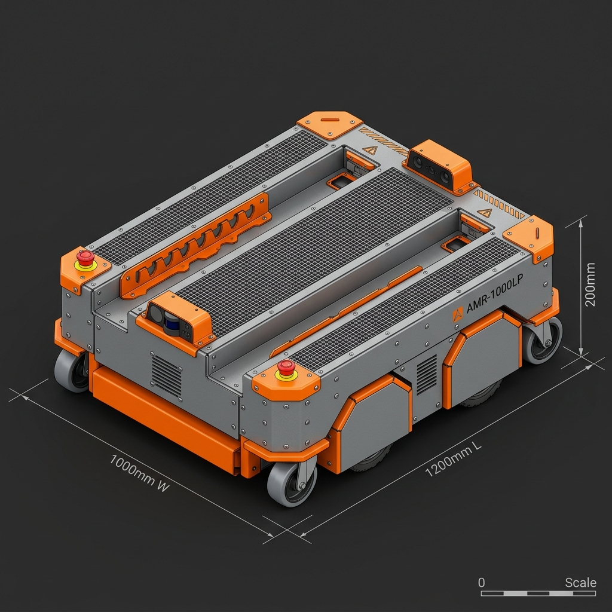
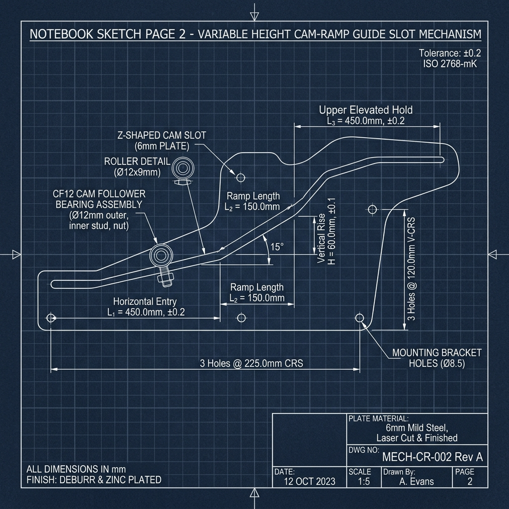

# Custom Sheet Metal Pallet AMR ($1000\text{ mm} \times 1200\text{ mm}$) - Master CAD Design & Dimensioning Guide

This document presents a complete mechanical analysis, rough CAD part dimensions, and sheet metal fabrication guidelines for your custom **$1000\text{ mm} \times 1200\text{ mm}$ Low-Profile Pallet AMR** based on the 3 hand-drawn notebook design sketches (Pages 8, 11, and 12).

---

## 1. Design Concept & Kinematic Mechanism Analysis

### Working Principle (Based on Notebook Sketches)
As shown in your hand-drawn sketches:
* **Notebook Page 8 (April 8):** Shows the isometric top view of the $1000\text{ mm} \times 1200\text{ mm}$ AMR body with two parallel recessed fork channels and 10 guide follower pin positions along the track.
* **Notebook Page 11 (April 11):** Details the **Variable Linear Guide Height / Z-Ramp Cam Slot Mechanism** (Ramp profiles 1 through 10).
  * *Why this works:* When the pallet forks retract inside the main chassis body, the cam follower pins ride UP the sloped Z-ramp slot. This **elevates the fork carriage vertically by $60\text{ mm}$**, lifting the pallet's bottom load wheels off the floor so the main AMR chassis can rotate and navigate freely!
* **Notebook Page 12 (April 12):** Shows the alternative scissor/pantograph linkage and the lower drive belt/wheel assembly layout.

---

## 2. 3D CAD Visualization & Master Blueprint

### A. 3D CAD Concept Render ($1000\text{ mm W} \times 1200\text{ mm L} \times 200\text{ mm H}$)
Constructed with bended $3.0\text{ mm}$ steel sheet metal, side drive compartments, laser-cut cam guide slot side plates, corner casters, and two recessed fork channels:

### B. 2D Engineering Blueprint - Variable Height Cam-Ramp Slot Mechanism
Detailing the Z-shaped sloped cam slot track profile drawn on Notebook Page 11:

---

## 3. Recommended Overall Height & Footprint Sizing

| Parameter | Recommended Dimension | Design Rationale & Clearance |
| :--- | :--- | :--- |
| **Overall Width ($W$)** | **1000 mm** | User target width |
| **Overall Length ($L$)** | **1200 mm** | User target length (fits standard $1200\text{ mm}$ ISO / EUR pallets) |
| **Lowered Chassis Height ($H_{low}$)**| **200 mm** | **Calculated Minimum Height:** Includes $160\text{ mm}$ drive wheel, $25\text{ mm}$ ground clearance, and $3.0\text{ mm}$ top/bottom sheet metal deck plates |
| **Raised Deck Height ($H_{raised}$)**| **260 mm** | Adds $60\text{ mm}$ vertical elevation travel from the cam Z-ramp |
| **Pallet Entry Fork Height** | **90 mm** | Lowered fork thickness to enter standard pallet pockets ($100\text{ mm}$ opening) |
| **Minimum Ground Clearance** | **25 mm** | Base sheet metal plate clearance above factory floor |

---

## 4. Rough Design Dimensions for ALL Sheet Metal Parts

Use the dimensional table below to begin modeling individual parts and sheet metal features in your CAD software (SolidWorks, Fusion 360, or Inventor):

| Part Name / Module | Material & Thickness | Key Dimensions (mm) | CAD Feature & Sheet Metal Notes |
| :--- | :--- | :--- | :--- |
| **1. Main Outer Chassis Hull** | $3.0\text{ mm}$ CRCA Mild Steel | $1000\text{ W} \times 1200\text{ L} \times 200\text{ H}$ | Outer bended enclosure with $15\text{ mm}$ stiffening lips and corner laser cutouts |
| **2. Left & Right Drive Bays** | $3.0\text{ mm}$ Mild Steel Sheet | $220\text{ W} \times 1200\text{ L} \times 200\text{ H}$ | Two side compartments housing motors, 24V/48V battery, controllers, and LiDARs |
| **3. Recessed Fork Channels** | $4.0\text{ mm}$ Mild Steel Sheet | Outer Width: **560 mm** Tyne Width: **160 mm** Inner Gap: **240 mm** | Centered between side bays ($220 + 160 + 240 + 160 + 220 = 1000\text{ mm}$). Tyne length: $1050\text{ mm}$ |
| **4. Cam Guide Slot Side Plates** | $6.0\text{ mm}$ Heavy Steel Plate | $1100\text{ L} \times 160\text{ H}$ (Laser cut) | $2\times$ side plates with CNC laser-cut $12.2\text{ mm}$ wide Z-shaped cam tracks |
| **Cam Track Breakdown:** | | | |
| *-- Horizontal Entry ($L_1$)* | Laser-cut Slot | Length: **450 mm**, Height: $40\text{ mm}$ | Fork lowered entry position ($90\text{ mm}$ deck height) |
| *-- Sloped Ramp ($L_2$)* | $15^\circ$ Inclined Slot | Length: **150 mm**, Rise: **60 mm** | $60\text{ mm}$ vertical elevation ramp curve |
| *-- Elevated Hold ($L_3$)* | Laser-cut Slot | Length: **450 mm**, Height: $100\text{ mm}$| Retracted raised position ($260\text{ mm}$ deck height) |
| **5. Cam Follower Bearings** | Stud-Type Bearings (CF12) | $\varnothing 30\text{ mm}$ Outer, $\varnothing 12\text{ mm}$ Stud | $4\times$ Heavy-duty stud cam followers mounted to inner fork carriage |
| **6. Inner Lifting Fork Carriage** | $4.0\text{ mm}$ Steel Sheet Weldment| $550\text{ W} \times 950\text{ L} \times 120\text{ H}$ | Bent U-frame carrying the top tynes with tab-and-slot welding alignment notches |
| **7. Drive Wheels (Differential)**| Polyurethane on Aluminum | $\varnothing 160\text{ mm} \times 50\text{ mm}$ Width | $2\times$ Center differential drive wheels ($\varnothing 25\text{ mm}$ shaft bore) |
| **8. Corner Swivel Casters** | Polyurethane Casters | $\varnothing 75\text{ mm}$ Wheel Dia | $4\times$ Corner swivel casters ($100\text{ mm}$ total mounting height) |
| **9. Drive Motors & Gearbox** | BLDC Servo Motors | 750W 24V (1:20 Planetary) | $2\times$ Motors mounted inside the $220\text{ mm}$ side bays |

---

## 5. Sheet Metal Fabrication Guidelines for CAD Modeling

1. **Bending Parameters:**
   * Sheet Thickness $t = 3.0\text{ mm}$ $\rightarrow$ Internal Bend Radius $R = 3.0\text{ mm}$ ($K\text{-factor} = 0.44$).
   * Sheet Thickness $t = 4.0\text{ mm}$ $\rightarrow$ Internal Bend Radius $R = 4.0\text{ mm}$ ($K\text{-factor} = 0.44$).
2. **Bend Reliefs:**
   * Add rectangular or teardrop bend relief cuts ($\text{Width} = 4.0\text{ mm}$, $\text{Depth} = 5.0\text{ mm}$) at all flange intersections to prevent metal tearing during press brake bending.
3. **Tab-and-Slot Alignment Notches:**
   * Incorporate laser-cut $15\text{ mm} \times 4\text{ mm}$ tabs and matching slots on internal structural bulkheads. This allows the sheet metal pieces to self-align during assembly before plug welding.
4. **Cam Track Surface Hardening:**
   * The $6.0\text{ mm}$ laser-cut cam slot side plates should be case-hardened (nitrided or induction hardened) to prevent localized indentation from the $\varnothing 30\text{ mm}$ steel cam followers under a $1000\text{ kg}$ payload.
