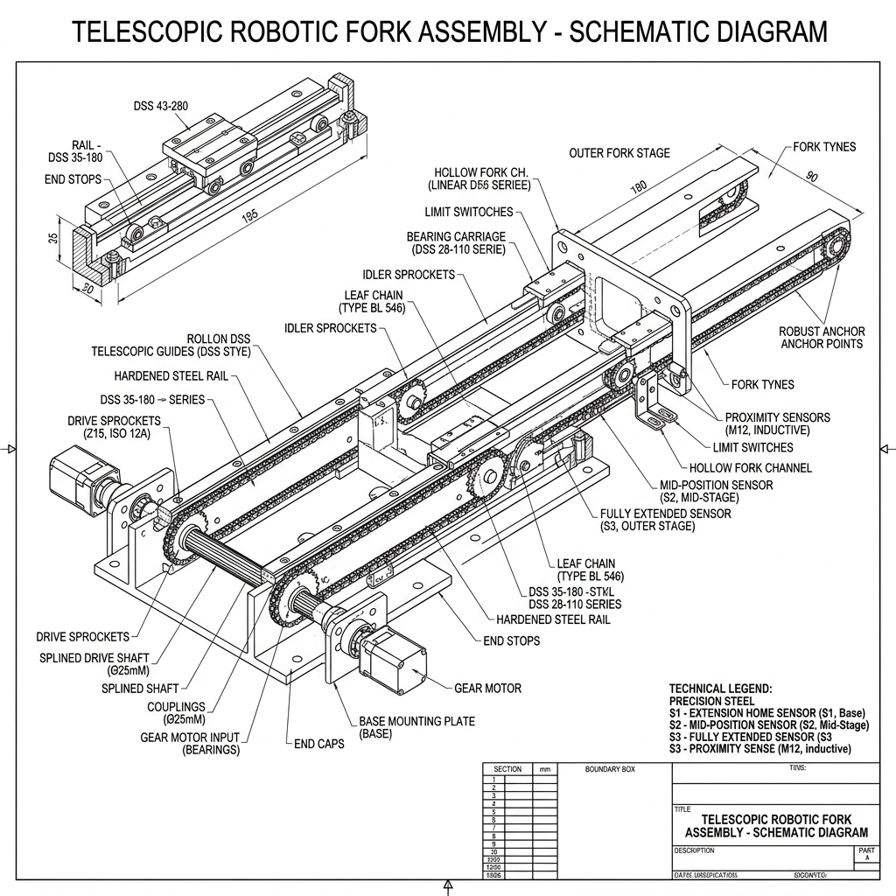
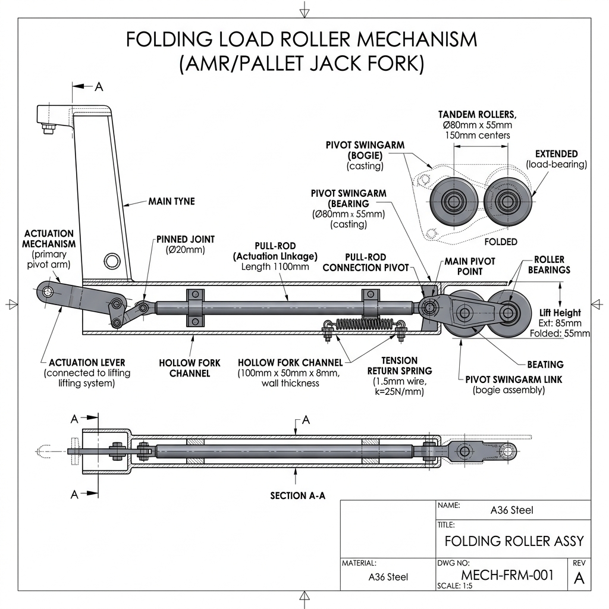
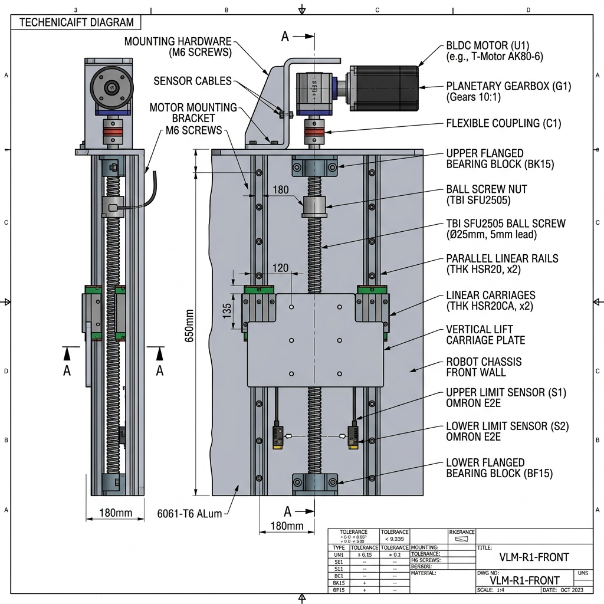
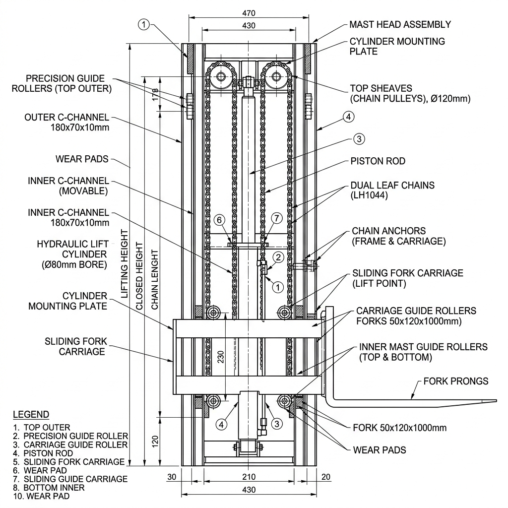

# Pallet AMR Mechanisms & Components Report

This engineering document details the core mechanical systems, kinematics, operational logic, and specific component selections used in different versions of the low-profile Autonomous Pallet-handling Robot (APR) family (specifically E10T, E10 standard, and FL10). 

For each mechanism, we outline **What it is**, **Why it is used**, **How it works**, and compile a **Component Specification Table**.

---

## 1. Telescopic Extending Fork Mechanism (Model: E10T)

### What It Is
A multi-stage, motorized horizontal fork extension system that allows the robot's load-bearing forks to slide out forward from the lift carriage into the pallet openings.

### Why It Is Used
Traditional AGVs must drive their entire chassis forward to insert forks under a pallet, requiring large clearance areas. The telescopic extending fork allows the robot to remain stationary in a narrow aisle and slide only its forks forward under the pallet. This reduces the aisle width requirement for picking and placing to just $2.0 \text{ m}$.

### How It Works
1. A single 24V 200W geared servo motor is mounted on the lift carriage.
2. This motor drives a transverse splined shaft.
3. Two chain drive sprockets slide along the splined shaft when the fork width adjusts, but rotate with it.
4. Each fork channel contains a dual-stage **Rollon DSS43** telescopic guide slide rail and a closed-loop leaf chain.
5. When the motor rotates the splined shaft, the chain loops pull the intermediate and outer stages of the telescopic slides forward, extending the forks by up to $1400\text{ mm}$ (over-extension).

### Diagram

### Components Used for Telescopic Fork Mechanism
| Component Name | Manufacturer / Model | Specifications | Function / Purpose |
| :--- | :--- | :--- | :--- |
| **Telescopic Slides** | Rollon / DSS43-1170 | Heavy-duty multi-stage linear slides; over-extension up to 1400mm; Q235 steel | Supports high vertical cantilever loads during fork extension |
| **Geared Drive Motor** | Leadshine / 24V 200W | Brushless DC geared servo motor; torque 2.5 Nm; integrated encoder | Actuates the transverse splined shaft to slide forks in/out |
| **Splined Drive Shaft** | Custom / Dia 25mm | High-tensile steel (40Cr), hardened spline profile | Transmits motor torque to sliding sprockets across adjustable width |
| **Leaf Chains & Sprockets** | local supplier / Type BL546 | High-strength leaf chains, Z15 sprockets | Pulls the telescopic slide stages forward and backward |
| **Proximity Sensors** | Sick / M12 Inductive | 4mm sensing range; NPN NO; IP67 | Detects home, mid-stage, and full-extension positions |

---

## 2. Retractable / Folding Load Roller Mechanism (E10T vs. E10 Standard)

### What It Is
A pivot swingarm assembly at the front tip of each fork that retracts the load rollers vertically up into the fork body or deploys them down to the warehouse floor.

### Why It Is Used
Double-sided pallets (such as EUR-2 and "田" shaped pallets) have closed bottom boards. A standard pallet wheel cannot roll over them without crashing. 
* **During Fork Travel/Extension (Wheels UP):** The rollers remain folded **UP** inside the fork thickness ($65 \text{ mm}$) so the forks can slide over the bottom boards of the pallet without collision. The forks extend suspended in the air (cantilevered), carrying only their own light weight, which the telescopic slides support easily.
* **During Lifting & Transit (Wheels DOWN):** Once the forks are fully inserted (so the wheels are directly over a gap in the pallet's bottom boards), the wheels deploy **DOWN** to contact the floor. The lift carriage then raises, and the wheels support the heavy 1-ton payload, transforming the cantilevered forks into simple supported beams.

### How It Works (Telescopic Forks vs. Fixed Forks)

Because the E10T forks extend telescopically by $1400\text{ mm}$, a rigid mechanical pull-rod connecting the tip wheel to the chassis carriage is impossible (it would bind or restrict extension). Therefore, two different actuation methods are used depending on the AMR model:

#### A. Telescopic Extending Fork (Model: E10T) - Motorized Actuation
1. A **compact, high-force 24V electric linear actuator** (or a miniature hydraulic cylinder) is mounted directly inside the tip of the outer fork stage.
2. Electrical power and control cables are routed from the main carriage to the actuator through a **flexible plastic drag chain (cable track)** that bends and nests inside the telescopic slide stages.
3. During extension, the actuator is kept fully retracted, holding the Bogie swingarm **UP** inside the fork cavity.
4. When the fork reaches full extension (detected by proximity sensors), the controller sends a 24V signal to the linear actuator, extending its piston shaft.
5. This pushes the bogie swingarm **DOWN** through the gaps in the bottom boards of the pallet until the polyurethane rollers contact the floor.

#### B. Fixed-Length Fork (Model: E10 Standard) - Passive Pull-Rod Linkage
1. Inside the hollow channel of each fixed fork runs a rigid **mechanical pull-rod**.
2. The front end of the pull-rod is pinned to the Bogie swingarm holding the tandem load rollers.
3. The rear end of the pull-rod is pinned to a lever on the vertical lift carriage frame.
4. When the carriage is at its lowest position, the linkage pulls the rod back, rotating the swingarm **UP** to fold the rollers inside the fork cavity.
5. As the carriage begins to rise, the linkage pushes the rod forward, forcing the swingarm to rotate **DOWN** to contact the floor.

### Diagram

### Components Used for Folding Wheel Mechanism
| Component Name | Manufacturer / Model | Specifications | Function / Purpose |
| :--- | :--- | :--- | :--- |
| **Tandem Load Rollers** | Blickle / Dia 60mm | Polyurethane tread on steel core, needle bearings, 350kg capacity each | Support wheels that roll on the warehouse floor under the pallet |
| **Pivot Swingarm (Bogie)**| Custom Weldment | Cast steel (45#), precision-machined pivot holes | Houses the tandem rollers and rotates relative to the fork tyne |
| **Electric Linear Actuator** | local supplier / 24V DC | Compact high-force linear actuator; 50mm stroke; thrust 2500 N (E10T specific) | Mounts inside telescopic fork tip to push/pull swingarm directly |
| **Flexible Drag Chain** | Igus / E2 Micro series | Miniature plastic energy chain; minimum bending radius 28mm (E10T specific) | Routes actuator power and sensor cables inside telescopic stages |
| **Actuation Pull-Rods** | Custom Turnbuckle | High-tensile steel rods (M16 threads) for length calibration (E10 standard specific) | Transmits vertical carriage motion to the front pivot swingarms |
| **Return Tension Springs**| local supplier / 1.5mm wire | Spring steel, rate $25\text{ N/mm}$, length 150mm | Pulls the swingarms back into the folded position when unloaded |
| **Pivot Pins & Bushings** | Misumi / Hardened Steel | Dia 20mm, self-lubricating bronze bushings | High-load joints for swingarm and pull-rod/actuator linkages |

---

## 3. Central Vertical Lift Carriage Mechanism (Models: E10, E10T)

### What It Is
A single-motor vertical slide carriage mounted on the front face of the AMR chassis that raises and lowers the entire fork carrier assembly.

### Why It Is Used
Rather than having separate scissor lifts and motors inside each fork (which increases weight, complexity, and fork thickness), the E10T uses a single central carriage lift. This keeps the forks extremely thin, eliminates the need for motor synchronization algorithms, and reduces cost.

### How It Works
1. Two vertical linear profile rails are mounted on the front plate of the robot chassis.
2. The vertical lift carriage plate slides vertically along these rails.
3. A single vertical ball screw (TBI SFU2505, $5 \text{ mm}$ lead) is mounted centrally.
4. A 1000W BLDC motor with a 1:15 gearbox is mounted at the top, coupled to the ball screw.
5. When the motor rotates the ball screw, the ball nut pushes the carriage vertically, lifting both forks, the telescopic slides, and the load simultaneously.
6. High and low inductive proximity sensors detect limits.

### Diagram

### Components Used for Central Lift Mechanism
| Component Name | Manufacturer / Model | Specifications | Function / Purpose |
| :--- | :--- | :--- | :--- |
| **Vertical Linear Guides** | Hiwin / HGR25 | Profile linear guide rails, L=500mm, carbon steel | Provides rigid vertical guidance and prevents carriage twisting |
| **Vertical Ball Screw** | TBI Motion / SFU2505 | Dia 25mm, 5mm lead, C7 accuracy, ball screw nut | Transforms motor rotation into high-force vertical linear motion |
| **BLDC Lift Motor** | Leadshine / 48V 1000W | Brushless DC motor; rated speed 3000 RPM; electromagnetic brake | Power source for lifting the 1-ton carriage assembly |
| **Planetary Gearbox** | local supplier / 1:15 ratio | Inline planetary gearbox; backlash < 8 arc-min; efficiency 95% | Multiplies motor torque to overcome vertical gravitational load |
| **Carriage Plate** | Custom CNC | 8mm A36 steel plate, precision welded | Mounts the forks, width slides, and telescopic extenders |
| **Limit Sensors** | Omron / E2E Proximity | Cylindrical inductive sensors, NC/NO outputs | Detects vertical travel limits to prevent mechanical crash |

---

## 4. Mast-Type Stacker Lift Mechanism (Model: FL10 Stacker)

### What It Is
A nested double-stage vertical mast lift system similar to traditional forklift masts, used on the FL10 high-reach stacker.

### Why It Is Used
The central lift carriage (Section 3) is limited to a lift height of $\sim 100\text{ to }200 \text{ mm}$ (just enough to clear the floor during transit). The FL10 requires lifting pallets up to $2.5 \text{ m}$ for double-layer stacking in warehouse racks. This requires a nested telescoping mast structure.

### How It Works
1. Outer C-channel steel masts are fixed to the robot chassis.
2. Inner C-channel masts slide vertically inside the outer masts on sealed guide rollers.
3. A central hydraulic cylinder or an electric motor-driven leaf chain lift (LH1044) is actuated.
4. The piston rod pushes the inner mast upward.
5. Leaf chains anchored to the outer mast run over sheaves at the top of the inner mast and attach to the fork carriage.
6. This 2:1 mechanical ratio lifts the fork carriage at twice the speed of the inner mast extension, reaching a lift height of $2500 \text{ mm}$.

### Diagram

### Components Used for Mast Lift Mechanism
| Component Name | Manufacturer / Model | Specifications | Function / Purpose |
| :--- | :--- | :--- | :--- |
| **Nested Mast Channels** | Custom / C-profile | High-strength steel Q345; $180\times70\times10\text{ mm}$ outer channel | Main structural guide channels for high-reach lifting |
| **Leaf Chains** | local supplier / LH1044 | Heavy-duty forklift leaf chains; pitch 15.875mm; tensile strength 80 kN | Suspends the carriage and transmits the 2:1 lifting force |
| **Lifting Cylinder** | Custom / Hydraulic | 80mm bore, 1200mm stroke, chrome-plated piston rod | Pushes the inner mast vertically (for hydraulic lift versions) |
| **Mast Guide Rollers** | local supplier / Sealed Ball | Dia 110mm, hardened outer race, double-sealed | Guide wheels that slide inside C-channels under bending moments |
| **Chain Sheaves (Pulleys)** | Custom / Dia 120mm | Cast iron core, deep groove, needle roller bearings | Guides the leaf chains at the top of the inner mast stage |
| **Wear Pads** | local supplier / Nylon-66 | Self-lubricating wear plates, low friction | Prevents metal-to-metal friction between nested mast channels |
