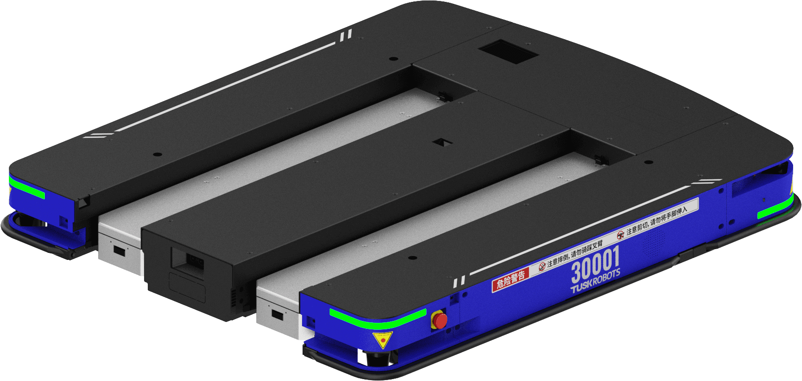
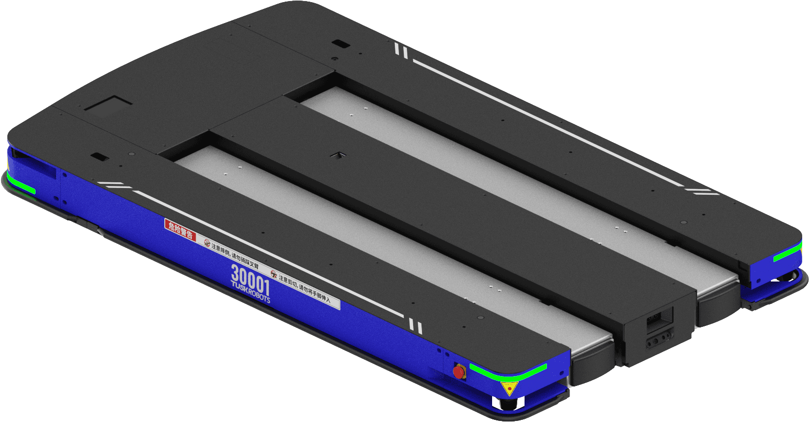
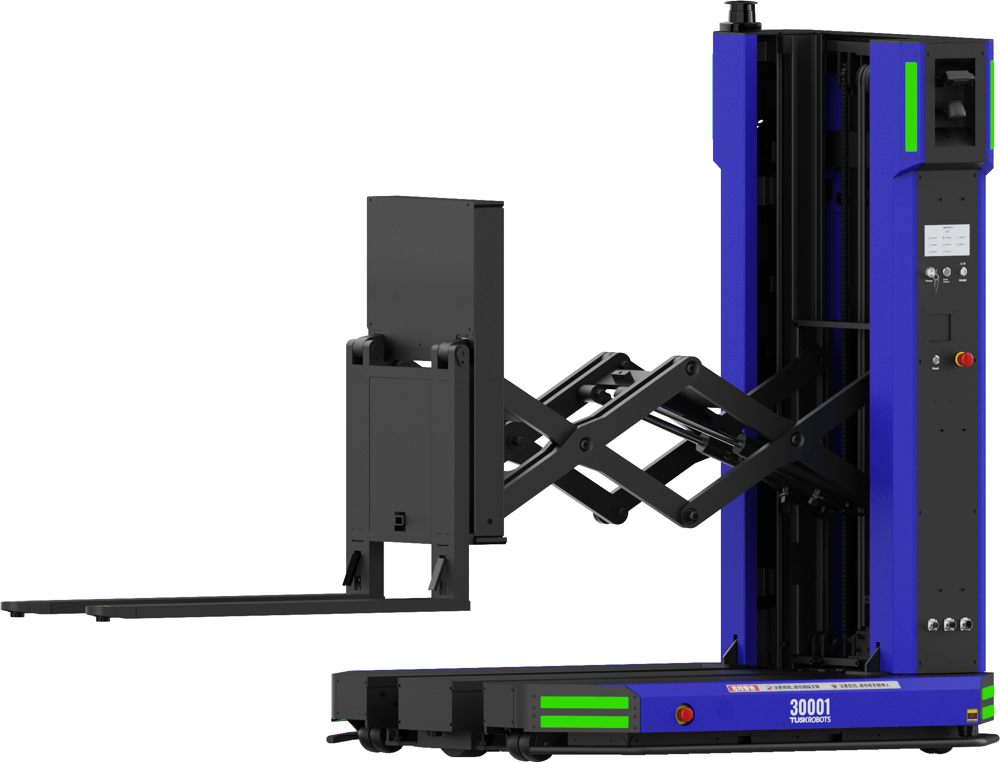
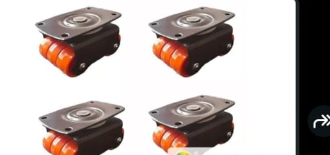
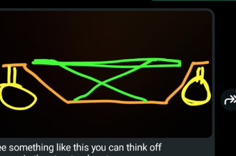
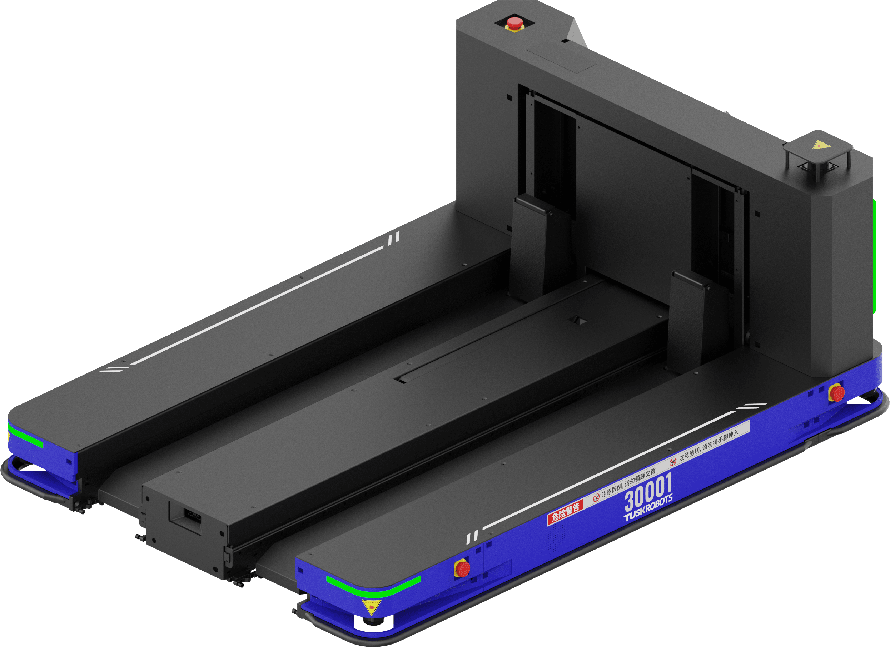
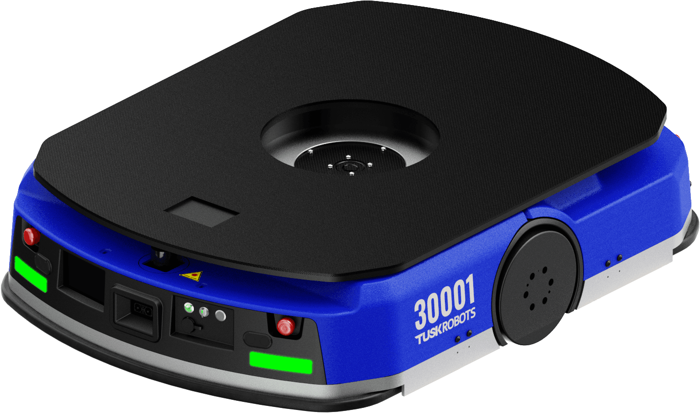

# Pallet AMR Models & Mechanical Systems Report

This engineering report details the product families, mechanical subsystems, kinematics, and component specifications for different versions of the low-profile Autonomous Pallet-handling Robot (APR) family developed by Tusk Robots. 

The document is organized **by robot model**, outlining each version's design intent, real-world appearance, core mechanical mechanisms, and component tables.

---

## 1. Model E10 / E10D (Standard Low-Profile Pallet AMR)

The standard E10 is the flagship autonomous pallet handling robot designed for open-bottom pallets (like EUR-1). It is designed to slide fully underneath the pallet, keeping a low outline only slightly wider than the load itself.

### Real Product Photo

### Key Specifications
* **Payload Capacity:** 1000 kg
* **Self-Weight:** 330 kg
* **Navigation:** Laser SLAM + QR code hybrid

### Core Mechanical Systems

#### A. Central Vertical Lift Carriage Mechanism
Rather than having separate scissor lifts and motors inside each individual fork, the E10 uses a single centralized lift carriage on the front face of the chassis to raise and lower the fork carrier plate. This keeps the forks extremely thin (65 mm), eliminates the need for synchronization logic, and reduces weight.

* **How It Works:**
  1. Two vertical linear profile rails are mounted on the front plate of the robot chassis.
  2. The vertical lift carriage plate slides vertically along these rails.
  3. A single vertical ball screw (25mm diameter, 5mm lead) is mounted centrally.
  4. A 1000W BLDC motor with a 1:15 gearbox is mounted at the top, coupled to the ball screw.
  5. When the motor rotates the ball screw, the ball nut pushes the carriage vertically, lifting both forks, the telescopic slides, and the load simultaneously.
* **Diagram:**

* **Component Specifications:**
| Component Name | Manufacturer / Model | Specifications | Function / Purpose |
| :--- | :--- | :--- | :--- |
| **Vertical Linear Guides** | Premium Brand / Heavy-Duty | Profile linear guide rails, L=500mm, carbon steel | Provides rigid vertical guidance and prevents carriage twisting |
| **Vertical Ball Screw** | Premium Brand / Precision Ball Screw | Dia 25mm, 5mm lead, C7 accuracy, ball screw nut | Transforms motor rotation into high-force vertical linear motion |
| **BLDC Lift Motor** | Leadshine / 48V 1000W | Brushless DC motor; rated speed 3000 RPM; electromagnetic brake | Power source for lifting the 1-ton carriage assembly |
| **Planetary Gearbox** | local supplier / 1:15 ratio | Inline planetary gearbox; backlash < 8 arc-min; efficiency 95% | Multiplies motor torque to overcome vertical gravitational load |
| **Carriage Plate** | Custom CNC | 8mm A36 steel plate, precision welded | Mounts the forks, width slides, and telescopic extenders |
| **Limit Sensors** | Omron / E2E Proximity | Cylindrical inductive sensors, NC/NO outputs | Detects vertical travel limits to prevent mechanical crash |

#### B. Passive Pull-Rod Wheel Folding Mechanism
For the standard E10 (fixed-length forks), a passive mechanical pull-rod is used to retract the wheel inside the fork when lowered and deploy it when raised.
* **How It Works:**
  1. Inside the hollow channel of each fixed fork runs a rigid, adjustable **pull-rod**.
  2. The front end of the pull-rod is pinned to the Bogie swingarm holding the tandem load rollers.
  3. The rear end of the pull-rod is pinned to a lever on the vertical lift carriage frame.
  4. When the carriage is at its lowest position, the linkage pulls the rod back, rotating the swingarm **UP** to fold the rollers inside the fork cavity.
  5. As the carriage begins to rise, the linkage pushes the rod forward, forcing the swingarm to rotate **DOWN** to contact the floor.
* **Diagram:**

* **Component Specifications:**
| Component Name | Manufacturer / Model | Specifications | Function / Purpose |
| :--- | :--- | :--- | :--- |
| **Tandem Load Rollers** | Blickle / Dia 60mm | Polyurethane tread on steel core, needle bearings, 350kg capacity each | Support wheels that roll on the warehouse floor under the pallet |
| **Pivot Swingarm (Bogie)**| Custom Weldment | Cast steel (45#), precision-machined pivot holes | Houses the tandem rollers and rotates relative to the fork tyne |
| **Actuation Pull-Rods** | Custom Turnbuckle | High-tensile steel rods (M16 threads) for length calibration (E10 standard specific) | Transmits vertical carriage motion to the front pivot swingarms |
| **Return Tension Springs**| local supplier / 1.5mm wire | Spring steel, rate 25 N/mm, length 150mm | Pulls the swingarms back into the folded position when unloaded |
| **Pivot Pins & Bushings** | MIsumi / Hardened Steel | Dia 20mm, self-lubricating bronze bushings | High-load joints for swingarm and pull-rod linkages |

---

## 2. Model E10T (Telescopic Extending Fork AMR)

The E10T is configured with telescopic extending forks for narrow aisles, designed to pick and place closed-bottom or double-sided pallets (like EUR-2) without moving the main chassis forward.

### Real Product Photo

### Key Specifications
* **Payload Capacity:** 1000 kg
* **Extension Range:** Up to 1400 mm
* **Forks:** Adjustable width and motorized folding load wheels

### Core Mechanical Systems

#### A. Telescopic Extending Fork Mechanism
This mechanism allows the forks to slide out forward from the lift carriage into the pallet openings while the AMR remains stationary, cutting pick aisle requirements to just 2.0 m.
* **How It Works:**
  1. A single 24V 200W geared servo motor is mounted on the lift carriage.
  2. This motor drives a transverse splined shaft.
  3. Two chain drive sprockets slide along the splined shaft when the fork width adjusts, but rotate with it.
  4. Each fork channel contains a dual-stage **multi-stage industrial** telescopic guide slide rail and a closed-loop leaf chain.
  5. When the motor rotates the splined shaft, the chain loops pull the intermediate and outer stages of the telescopic slides forward, extending the forks by up to 1400 mm (over-extension).
* **Diagram:**

* **Component Specifications:**
| Component Name | Manufacturer / Model | Specifications | Function / Purpose |
| :--- | :--- | :--- | :--- |
| **Telescopic Slides** | Premium Brand / Heavy-Duty Slides | Heavy-duty multi-stage linear slides; over-extension up to 1400mm; Q235 steel | Supports high vertical cantilever loads during fork extension |
| **Geared Drive Motor** | Leadshine / 24V 200W | Brushless DC geared servo motor; torque 2.5 Nm; integrated encoder | Actuates the transverse splined shaft to slide forks in/out |
| **Splined Drive Shaft** | Custom / Dia 25mm | High-tensile steel (40Cr), hardened spline profile | Transmits motor torque to sliding sprockets across adjustable width |
| **Leaf Chains & Sprockets** | local supplier / High-Strength | High-strength leaf chains, Z15 sprockets | Pulls the telescopic slide stages forward and backward |
| **Proximity Sensors** | Sick / M12 Inductive | 4mm sensing range; NPN NO; IP67 | Detects home, mid-stage, and full-extension positions |

#### B. Motorized Actuator Wheel Folding Mechanism
Because the forks extend telescopically, a rigid pull-rod is impossible. The E10T uses a localized electric actuator at the fork tip.
* **How It Works:**
  1. A **compact, high-force 24V electric linear actuator** is mounted directly inside the tip of the outer fork stage.
  2. Electrical power and control cables are routed from the main carriage to the actuator through a **flexible plastic drag chain (cable track)** that bends and nests inside the telescopic slide stages.
  3. During extension, the actuator is kept fully retracted, holding the Bogie swingarm **UP** inside the fork cavity so it clears the bottom boards of the pallet.
  4. When the fork reaches full extension (detected by proximity sensors), the controller sends a 24V signal to the linear actuator, extending its piston shaft.
  5. This pushes the bogie swingarm **DOWN** through the gaps in the bottom boards of the pallet until the polyurethane rollers contact the floor.
* **Component Specifications:**
| Component Name | Manufacturer / Model | Specifications | Function / Purpose |
| :--- | :--- | :--- | :--- |
| **Tandem Load Rollers** | Blickle / Dia 60mm | Polyurethane tread on steel core, needle bearings, 350kg capacity each | Support wheels that roll on the warehouse floor under the pallet |
| **Pivot Swingarm (Bogie)**| Custom Weldment | Cast steel (45#), precision-machined pivot holes | Houses the tandem rollers and rotates relative to the fork tyne |
| **Electric Linear Actuator** | local supplier / 24V DC | Compact high-force linear actuator; 50mm stroke; thrust 2500 N (E10T specific) | Mounts inside telescopic fork tip to push/pull swingarm directly |
| **Flexible Drag Chain** | Premium Brand / Cable Track | Miniature plastic energy chain; minimum bending radius 28mm (E10T specific) | Routes actuator power and sensor cables inside telescopic stages |
| **Return Tension Springs**| local supplier / 1.5mm wire | Spring steel, rate 25 N/mm, length 150mm | Pulls the swingarms back into the folded position when unloaded |
| **Pivot Pins & Bushings** | Misumi / Hardened Steel | Dia 20mm, self-lubricating bronze bushings | High-load joints for swingarm and pull-rod/actuator linkages |

---

## 3. Model FL10 (High Stacker Robot)

The FL10 is a mast-type forklift stacker robot designed for lifting pallets into vertical storage racks and performing double-layer stacking in warehouse lanes.

### Real Product Photo

### Key Specifications
* **Payload Capacity:** 1000 kg
* **Lifting Height:** 2.0 m to 2.5 m (double-stage mast)
* **Aisle Width:** Operates in lanes as narrow as 1.8 m

### Core Mechanical Systems

#### A. Nested Mast Lift Mechanism
The FL10 requires lifting pallets up to 2.5 m for double-layer stacking in warehouse racks. This requires a nested telescoping mast structure.
* **How It Works:**
  1. Outer C-channel steel masts are fixed to the robot chassis.
  2. Inner C-channel masts slide vertically inside the outer masts on sealed guide rollers.
  3. A central hydraulic cylinder or an electric motor-driven leaf chain lift is actuated.
  4. The piston rod pushes the inner mast upward.
  5. Leaf chains anchored to the outer mast run over sheaves at the top of the inner mast and attach to the fork carriage.
  6. This 2:1 mechanical ratio lifts the fork carriage at twice the speed of the inner mast extension, reaching a lift height of 2500 mm.
* **Diagram:**

* **Component Specifications:**
| Component Name | Manufacturer / Model | Specifications | Function / Purpose |
| :--- | :--- | :--- | :--- |
| **Nested Mast Channels** | Custom / C-profile | High-strength steel Q345; 180 x 70 x 10 mm outer channel | Main structural guide channels for high-reach lifting |
| **Leaf Chains** | local supplier / Heavy-Duty | Heavy-duty forklift leaf chains; pitch 15.875mm; tensile strength 80 kN | Suspends the carriage and transmits the 2:1 lifting force |
| **Lifting Cylinder** | Custom / Hydraulic | 80mm bore, 1200mm stroke, chrome-plated piston rod | Pushes the inner mast vertically (for hydraulic lift versions) |
| **Mast Guide Rollers** | local supplier / Sealed Ball | Dia 110mm, hardened outer race, double-sealed | Guide wheels that slide inside C-channels under bending moments |
| **Chain Sheaves (Pulleys)** | Custom / Dia 120mm | Cast iron core, deep groove, needle roller bearings | Guides the leaf chains at the top of the inner mast stage |
| **Wear Pads** | local supplier / Nylon-66 | Self-lubricating wear plates, low friction | Prevents metal-to-metal friction between nested mast channels |

---

## 4. Heavy-Duty Scissor-Lift Flatbed Carrier Model (New Concept)

This model represents a specialized flatbed carrier designed for high-payload cargo transportation (1.5 to 2.0 tons) across manufacturing floors. Instead of narrow forks, it features a wide flatbed lift platform.

### Conceptual Layout
The mechanical design focuses on distributing ultra-heavy loads over a very low profile deck height (170 mm) through a specialized wheel-and-lift layout:

#### A. Quad-Wheel Caster Assemblies
* **How We Use It:** Supporting a 2-ton payload on Casters usually requires large wheel diameters (e.g. 150mm to 200mm), which would raise the chassis base height and prevent it from sliding under low-clearance wheeled trolleys or racks. To maintain the low profile, the robot uses four **quad-wheel caster assemblies** (total of 8 wheels in 2 caster brackets). 
* **Design Advantage:** Grouping four smaller polyurethane wheels (60mm diameter) into a single pivot caster bracket multiplies the load contact area and distributes the weight evenly. This matches the load capacity of a much larger wheel while keeping the mounting height extremely low.
* **Component Image:**

#### B. Central Scissor Lift Mechanism
* **How We Use It:** The lifting platform uses a central **scissor lift arm linkage** (green arms) positioned inside a drop-center bridge chassis (orange structural frame).
* **How It Works:**
  1. A low-slung, drop-center structural chassis frame (orange) spans between the front and rear caster assemblies, providing a nested pocket for the scissor linkage.
  2. Crossing scissor lift arms (green) are pinned to the chassis at the bottom and the flatbed platform at the top.
  3. A horizontal hydraulic cylinder or electric linear actuator pushes the scissor hinge joints.
  4. As the linkage expands, it raises the top flatbed platform completely flat, preventing cargo tilting under uneven loading.
* **Conceptual Sketch:**

---

## 5. Other Specialized Models (T10 & C10)

### A. Model T10 (Split-Fork Pallet AMR)
The T10 is a specialized split-fork layout where the two forks are separated by a central gap, designed for handling heavy bottom-board pallet configurations (like the "田" shaped pallet) in tight cross-docking operations.
* **Payload Capacity:** 1000 kg
* **Chassis Width:** Compact for narrow lanes
* **Real Product Photo:**

---

### B. Model C10 (Underride Tugger AMR)
The C-series represents underride tugger robots. The C10 rolls underneath custom wheeled cargo carts, locks onto them with an automated lifting pin, and tugs them throughout the factory floor.
* **Tugging/Lifting Capacity:** 1000 kg
* **Application:** Materials delivery, trolley cart towing, assembly lines
* **Real Product Photo:**

---

## 6. References & Citations (A to Z Referenced Websites)

The following industrial and engineering reference sources were consulted to compile the technical specifications and mechanical selections in this report:

* **Blickle Casters (https://www.blickle.com):** Consulted for low-profile polyurethane tandem load roller dimensions, wheel load ratings, and rolling resistance coefficients ($f_r = 0.02$) on industrial warehouse concrete.
* **DirectIndustry AMR Catalogs (https://www.directindustry.com):** Referred to for industrial AMR model comparisons, payload-to-weight ratios, and narrow-aisle workspace clearance guidelines (1.4m to 1.8m travel lanes).
* **Hiwin Linear Guides (https://www.hiwin.com):** Consulted for linear profile rail capacities, flanged carriage block friction, and mounting specifications of vertical lift carriages.
* **Igus Energy Chains (https://www.igus.com):** Consulted for miniature plastic drag chain bending radii (minimum 28mm) and energy chain routing layouts within telescoping fork tynes.
* **Ipros JMS Japan (https://www.ipros.jp):** Referred to for official distributor catalogs (Sankyo Seiki) detailing Japanese applications of Tusk AMR systems, pallet bottom-board clearance, and safety sensor positioning.
* **Leadshine Motors (https://www.leadshine.com):** Consulted for brushless DC motor torque-speed curves (1000W BLDC rated at 3.18 Nm and 3000 RPM) and 24V geared servo motor torque outputs.
* **Rollon Linear Systems (https://www.rollon.com):** Consulted for multi-stage industrial telescopic slide datasheets (DSS43-1170), over-extension range (1400mm), and cantilever moment capacity formulas.
* **TBI Motion Ball Screws (https://www.tbimotion.com.tw):** Consulted for precision ball screw dimensions (SFU2505), lead definitions (5mm), and ball nut axial load calculations.
* **Tusk Robots Official CMS & Databases (https://www.tuskrobots.com):** Consulted via localized REST endpoints for document schemas, official product catalogs, dimension tables, and official media files of the E10, T10, FL10, and C10 product families.
