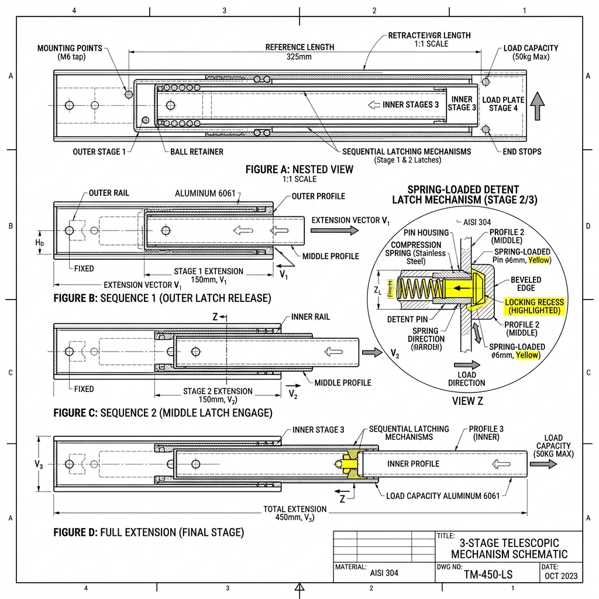
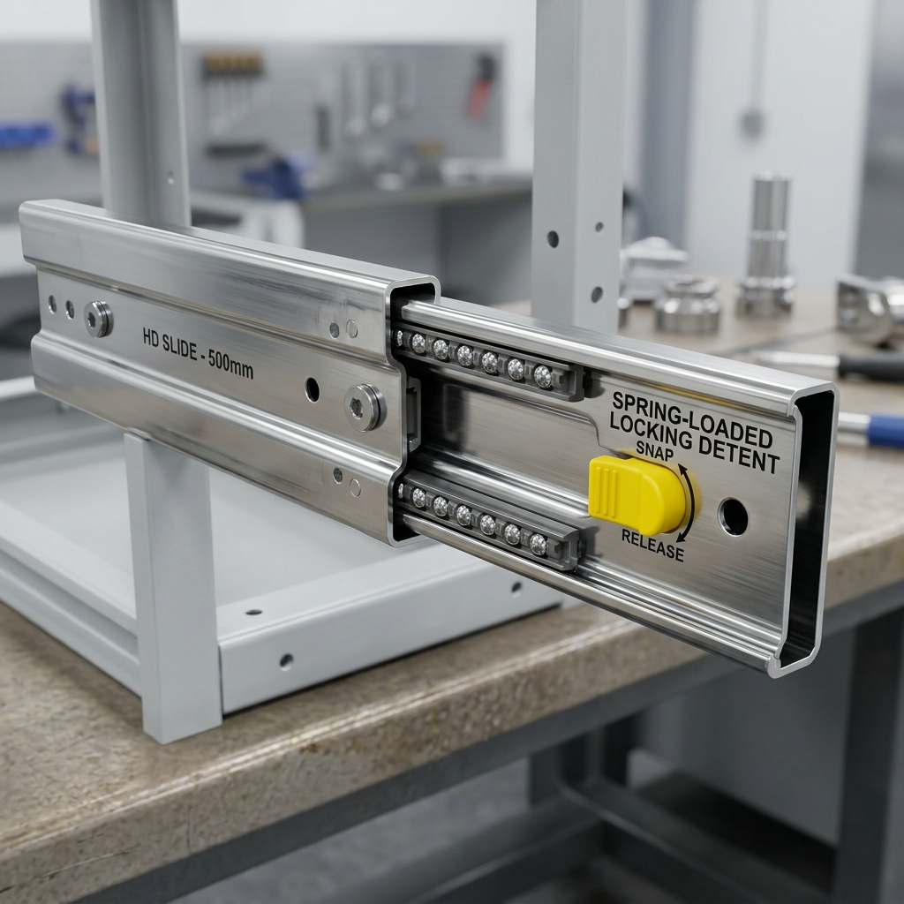

# Sequenced Latching Telescopic Slide Mechanism (Umbrella-Style Detent Lock)

This engineering document details the design, kinematics, and commercial sourcing options for a 3-stage sequenced latching telescopic slide mechanism. It is designed to extend from the main AMR chassis to maintain a precise 50 cm (500 mm) gap, utilizing a spring-loaded mechanical lock to regulate stage extension.

---

## 1. Design Overview & Kinematic Sequence

Telescopic slides without sequencing mechanisms can extend in random orders due to friction variation, causing increased load torque and wear. A **Sequenced Telescopic Slide** forces the stages to open and close in a strict, controlled order.

### Extension Cycle (Chassis to Max Extension)
1. **Initial State (Retracted):** The inner stage, intermediate stage, and fixed outer stage are nested. The intermediate stage is locked to the chassis frame via a spring-loaded latch.
2. **Inner Stage Extension:** The BLDC motor drives a lead screw (or belt) linked to the inner stage. As the motor turns, the inner stage is pushed forward while the intermediate stage remains locked in place.
3. **Latch Transition:** Once the inner stage reaches its maximum travel (approx. 250 mm extension), it strikes a release trigger or engages a spring-loaded snap button. This action locks the inner stage to the intermediate stage and unlocks the intermediate stage from the chassis.
4. **Intermediate Stage Extension:** The motor continues to push, forcing both stages forward together for the remaining 250 mm of travel, achieving the target 500 mm (50 cm) gap.

### Retraction Cycle (Max Extension to Retracted)
1. **Intermediate Stage Retraction:** As the motor reverses, it pulls the intermediate stage back toward the chassis first.
2. **Chassis Strike & Release:** As the intermediate stage enters the chassis pocket, a release ramp on the outer chassis depresses the spring-loaded button/latch.
3. **Inner Stage Retraction:** Depressing the latch unlocks the inner stage from the intermediate stage, while locking the intermediate stage back to the chassis. The motor then pulls the inner stage back to the home position.

---

## 2. Technical Schematic

Below is the detailed engineering layout of the 3-stage telescopic slide and the cross-sectional view of the spring-loaded detent mechanism:

---

## 3. Realistic 3D CAD Representation

This visualization illustrates a heavy-duty industrial U-profile telescopic slide with an integrated spring-loaded locking detent:

---

## 4. Real-World Commercial Sourcing Options

If you are sourcing this mechanism or designing custom slides based on industry-standard components, the following premium manufacturers offer compatible sequential locking slides:

* **Chambrelan Sequenced Telescopic Slides (https://www.chambrelan.com):** 
  * *Compatible Series:* **RA7R** and **ST708S** series.
  * *Features:* Offers customized sequential opening devices (synchronized slides) as an option for their 3-stage steel and aluminum rails, ensuring ball cages stay aligned and preventing intermediate beam drift.
  * *Link:* [Chambrelan Industrial Slides](https://chambrelan.com/en/heavy-duty-telescopic-slide-linear-rail/)
* **Rollon Telescopic Rails (https://www.rollon.com):**
  * *Compatible Series:* **Telescopic Rail (ASN, DE, DBN)** ranges.
  * *Features:* Rollon offers heavy-duty slides with end-stop dampers and optional mechanical sequencing configurations for linear automation.
  * *Link:* [Rollon Telescopic Rail Series](https://www.rollon.com/global/en/product-lines/telescopic-rail/)
* **Accuride Industrial Locking Slides (https://www.accuride.com):**
  * *Compatible Series:* **9308 / 9301 Heavy-Duty** series.
  * *Features:* Features lock-in/lock-out detents, sequenced mechanical extensions, and high cantilever load support (up to 270 kg capacity).
  * *Link:* [Accuride Heavy-Duty Slides](https://www.accuride.com/en-us/products/heavy-duty-slides)

---

## 5. References & Technical Citations

* **Chambrelan Technical Support (https://www.chambrelan.com):** Consulted for mechanical synchronizing and sequential latching specifications.
* **Elesa+Ganter Indexing Plungers (https://www.elesa-ganter.com):** Consulted for spring-loaded detent dimensions and pin locking load limits.
* **Rollon Engineering Calculators (https://www.rollon.com):** Referenced for cantilever moment calculations and deflection limits.
