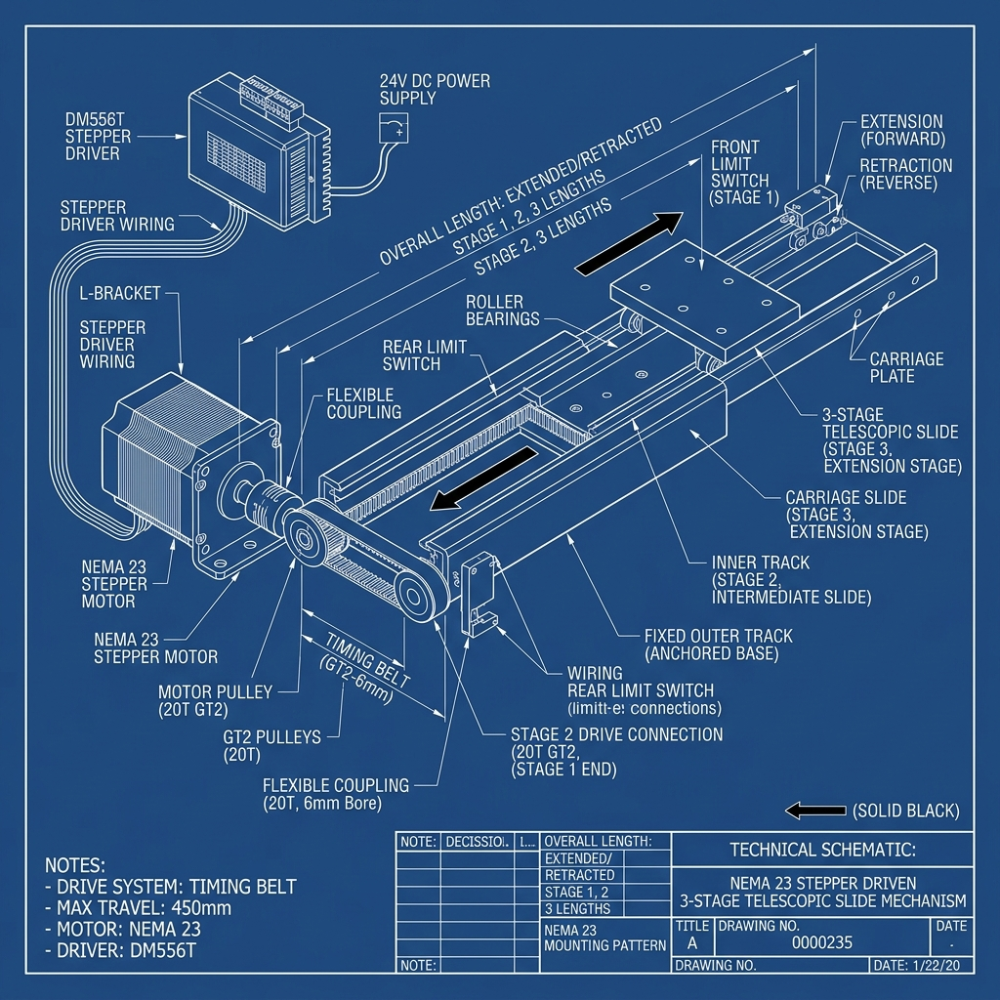
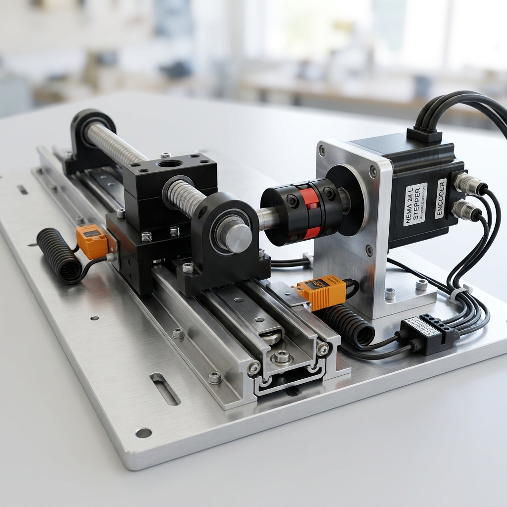

# Stepper Motor Drive Guide for AMR Telescopic Slides

This guide explains how to operate, configure, and manage a telescopic slide mechanism using a stepper motor. It details low-level hardware control, comparison of drive types, microcontroller logic, and compares it to how Tusk Robots manages its telescoping tynes.

---

## 1. How to Operate a Stepper Motor (Low-Level Control)

To operate a stepper motor on an AMR, you need three core components in the electronic control stack:

```
[ Microcontroller / PLC ] ──► [ Stepper Driver ] ──► [ Stepper Motor ] ──► [ Telescopic Slide ]
  (Teensy / STM32 / CAN)        (DM556 / CL57T)        (NEMA 23/24)
```

### A. Closed-Loop vs. Open-Loop Stepper Systems
* **Open-Loop (Not Recommended for AMRs):** Simple and cheap, but if the forks encounter an obstruction (e.g., hitting a pallet wall), the motor will lose steps, causing the navigation system to lose track of the fork extension distance.
* **Closed-Loop (Recommended):** Utilizes a NEMA 23/24 stepper motor with an **integrated rotary encoder** (typically 1000 to 4000 CPR). The driver monitors the encoder feedback and automatically adjusts current to prevent step loss and can signal a fault to the main controller if a stall occurs.

### B. Controller Interface Methods
1. **Pulse & Direction (PUL / DIR):**
   * The microcontroller sends a square-wave frequency to the driver's **PUL** pin (1 pulse = 1 microstep rotation) and toggles the **DIR** pin high/low to control direction.
   * A third **ENA** (Enable) pin is toggled to power on/off the motor coils.
2. **Fieldbus Control (CANopen / Modbus RTU):**
   * Uses serial communication lines to send command packets (e.g., "Go to position 5000 steps at speed 1000 RPM"). This eliminates pulse wiring and allows the controller to read real-time torque and speed values from the driver.

---

## 2. Stepper Drive Configurations (Types of Drives)

### Option A: Timing Belt & Pulley Drive
The stepper motor is mounted at the rear of the slide and rotates a driving pulley, which pulls a loop of heavy-duty timing belt (e.g., GT2 6mm or 9mm width) attached to the moving stages.

* **Diagram:**


* **Key Specifications:**
  * **Stepper Motor:** NEMA 23 High-Torque ($1.8^\circ$ step angle, 2.2 Nm holding torque)
  * **Stepper Driver:** DM556T (24V-50V DC power supply, set to 1600 steps/revolution microstepping)
  * **Drive Pulley:** 20-Tooth GT2 Pulley ($\varnothing 6.35\text{ mm}$ bore to match motor shaft)
  * **Performance:** High extension speed, quiet operation, but susceptible to belt stretch under heavy load.

---

### Option B: Ball Screw Drive
The stepper motor is coupled directly to a precision ball screw (e.g., SFU1605) using a flexible jaw coupling. As the screw rotates, the ball nut drives the intermediate stage.

* **CAD Render:**


* **Key Specifications:**
  * **Stepper Motor:** NEMA 24 Closed-Loop Stepper with Integrated Encoder
  * **Drive System:** SFU1605 Ball Screw ($16\text{ mm}$ diameter, $5\text{ mm}$ lead)
  * **Coupling:** Flexible D30L40 Plum Coupling ($8\text{ mm}$ to $10\text{ mm}$ bore)
  * **Limit Switches:** Inductive Proximity Sensors (LJ12A3-4-Z/BX) at both travel limits
  * **Performance:** Extreme thrust force, zero back-driving, high precision, but slower extension speed.

---

## 3. Low-Level Control Logic (STM32/Arduino Pseudo-code)

Below is the control logic for homing, extending, and detecting obstructions using a pulse-generator microcontroller:

```cpp
// Pin Definitions
const int pulPin = 3;
const int dirPin = 4;
const int enPin = 5;
const int limitHome = 6;      // Retracted limit switch
const int limitExtended = 7;  // Fully extended limit switch
const int driverFault = 8;    // Fault signal from Closed-Loop driver

void setup() {
  pinMode(pulPin, OUTPUT);
  pinMode(dirPin, OUTPUT);
  pinMode(enPin, OUTPUT);
  pinMode(limitHome, INPUT_PULLUP);
  pinMode(limitExtended, INPUT_PULLUP);
  pinMode(driverFault, INPUT);
  
  digitalWrite(enPin, HIGH); // Enable motor coils
  homeForks();
}

void homeForks() {
  // Step backward slowly until home limit switch is triggered
  digitalWrite(dirPin, LOW); 
  while (digitalRead(limitHome) == HIGH) {
    digitalWrite(pulPin, HIGH);
    delayMicroseconds(1000); // Homing speed
    digitalWrite(pulPin, LOW);
    delayMicroseconds(1000);
  }
  // Reset step counter
  currentPositionSteps = 0;
}

void extendForks(long targetSteps) {
  digitalWrite(dirPin, HIGH); // Extend direction
  
  for (long i = 0; i < targetSteps; i++) {
    // Check for safety limit switch or driver fault
    if (digitalRead(limitExtended) == LOW || digitalRead(driverFault) == HIGH) {
      stopMotor();
      break;
    }
    
    // Pulse output (implementing simple ramp profile for acceleration)
    int pulseDelay = calculateRampDelay(i, targetSteps);
    digitalWrite(pulPin, HIGH);
    delayMicroseconds(pulseDelay);
    digitalWrite(pulPin, LOW);
    delayMicroseconds(pulseDelay);
  }
}
```

---

## 4. How Telescoping Slides are Managed in Tusk Robots

In official commercial Tusk AMRs (such as the E10T telescopic fork model), the telescoping mechanism is managed via a robust industrial architecture:

1. **Integrated Geared Servos (Instead of Open-Loop Steppers):**
   Tusk uses high-efficiency **brushless DC geared servo motors** or **closed-loop hybrid step-servos** operating on a 24V or 48V DC bus. They are geared down (typically 1:10 or 1:15) to multiply torque for handling heavy pallets.
2. **CANopen Network Interface:**
   The motor drives communicate with the low-level micro-ROS node (running on an STM32 MCU) via a **CANopen fieldbus** loop. This allows the robot to send precise velocity and position commands and read motor temperature, current, and encoder counts in real-time.
3. **Dual Fork Synchronization:**
   The Tusk E10T uses a single motor linked to a transverse splined shaft that drives the left and right telescopic slides together. This mechanical lock ensures the forks extend in perfect synchronization, preventing binding.
4. **Current-Limit Obstruction Detection:**
   The STM32 low-level safety controller constantly monitors the current consumption of the fork drive motor. If the current spikes above a safety threshold (indicating that the forks have collided with a pallet beam or obstruction), the MCU immediately commands a halt, cuts driver power, and triggers a ROS E-stop alert.
5. **Inductive Limit Proximity Sensors:**
   PNP-type inductive proximity sensors are mounted at the retracted (home) and fully-extended limits inside the fork casing. They act as hard-stop electrical interlocks to prevent mechanical crash damage.
