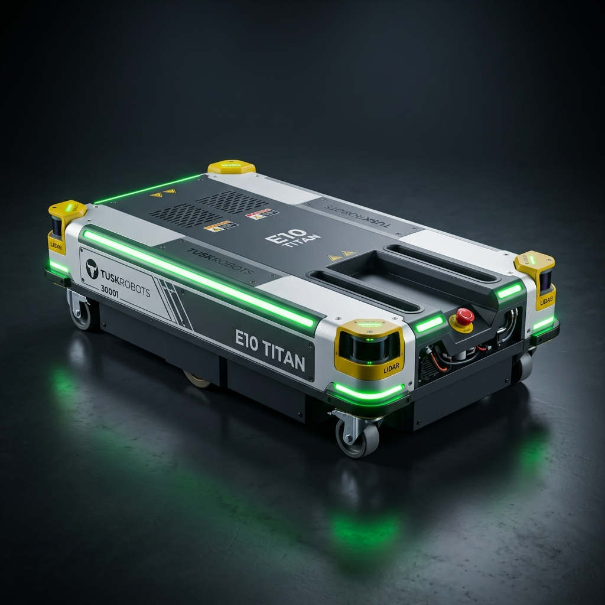
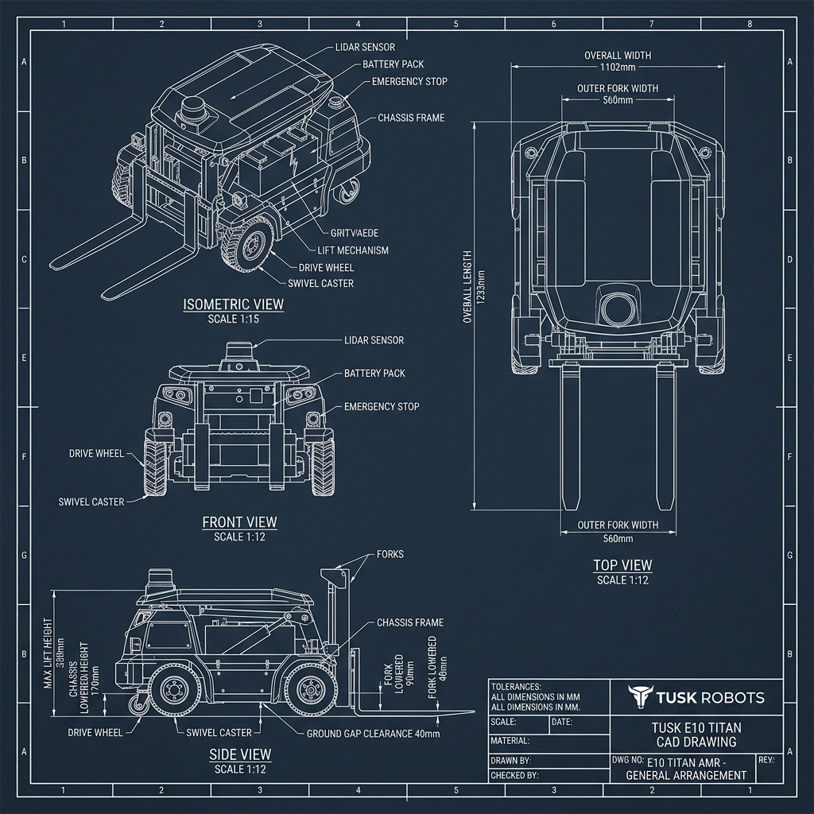

# Tusk Robots E10 (Titan) Pallet AMR - Master CAD Design & Dimensioning Guide

This engineering guide details the exact mechanical dimensions, specifications, CAD blueprints, and component callouts for the **Tusk Robots E10 (Titan)** heavy-load low-profile pallet AMR (Invisible Fork Arm / Recessed Channel design).

---

## 1. Product Overview & Visual Identification

The **Tusk E10 (Titan)** is Tusk Robots' flagship high-capacity autonomous mobile robot designed for handling heavy pallets (up to 1,500 kg) in narrow aisles without traditional bulky fork masts.

### Key Architectural Characteristics (As Per E10 Titan Specs)
* **Body Configuration:** Low-profile rectangular chassis featuring silver-white side panels and a dark grey central bed with flush embedded fork channels.
* **Perimeter Safety & Status Lighting:** Green LED perimeter light strips running continuously around the chassis corners.
* **Obstacle Avoidance:** Dual 360° safety laser LiDAR sensors mounted on opposite corners inside protective yellow housings.
* **Side Panel Layout:** Emergency Stop button, battery charging port, and side brand markings (`30001 TUSKROBOTS`).

---

## 2. Master CAD Dimensioning Table (E10 Titan Specs)

Use these exact dimensions when setting up sketch origins, planes, and extrusions in SolidWorks, Fusion 360, or Inventor:

| Parameter / Feature | E10 (Titan) Dimension | Tolerance | CAD Modeling Notes |
| :--- | :--- | :--- | :--- |
| **Rated Load Capacity** | **1,200 kg** (Max **1,500 kg**) | — | Industrial heavy-payload class |
| **Robot Self-Weight** | **310 kg** | $\pm 5.0\text{ kg}$ | Includes battery and drive motors |
| **Overall Robot Length** | **1233 mm** (Standard) / **1399 mm** (SLAM) | $\pm 1.0\text{ mm}$ | Length of outer chassis envelope |
| **Overall Robot Width** | **1102 mm** | $\pm 1.0\text{ mm}$ | Chassis outer side panel width |
| **Chassis Lowered Height** | **170 mm** | $\pm 0.5\text{ mm}$ | Total height from floor to top deck |
| **Fork Lowered Height** | **90 mm** | $\pm 0.5\text{ mm}$ | Has $7\text{ mm}$ downward floating stroke |
| **Max Lifting Height** | **$\le 330\text{ mm}$** | $\pm 1.0\text{ mm}$ | Total vertical lift travel: $160\text{ mm}$ |
| **Fork Stretch / Reach Limit** | **1400 mm max** | $\pm 2.0\text{ mm}$ | Telescopic extension option |
| **Outer Fork Assembly Width** | **560 mm** | $\pm 0.5\text{ mm}$ | Fits standard EUR-2 / ISO pallets |
| **Inner Fork Gap** | **240 mm** | $\pm 0.5\text{ mm}$ | Width between left & right tynes |
| **Individual Tyne Width** | **160 mm** | $\pm 0.5\text{ mm}$ | $\frac{560 - 240}{2} = 160\text{ mm}$ |
| **Ground Gap Clearance** | **40 mm** | $\pm 0.5\text{ mm}$ | Chassis bottom plate to floor |
| **Step Crossing Capacity** | **15 mm** | $\pm 1.0\text{ mm}$ | Max obstacle step height |
| **Max Slope / Gradeability** | **$4^\circ$ ($7\%$)** | — | Fully loaded gradeability limit |
| **Max Travel Speed** | **2.0 m/s** (Empty) / **1.5 m/s** (Loaded) | — | Closed-loop speed control |

---

## 3. Master 2D CAD Blueprint Drawing Sheet (E10 Titan)

Use this engineering blueprint sheet for orthographic projection alignment and dimension placement:

---

## 4. Component Bill of Materials (BOM) & Specifications

| Subsystem | Component Name | Material / Spec | Quantity | Engineering Function |
| :--- | :--- | :--- | :---: | :--- |
| **Chassis Frame** | Base Weldment | Q235 Steel Tube ($80\times 60\times 4\text{ mm}$) | 1 Set | Main structural load-bearing frame |
| **Top Deck** | Cover Plate | Q235 Steel Plate ($8\text{ mm}$) | 1 Set | Recessed center deck with embedded tynes |
| **Drive Motors** | BLDC Gearmotors | 750W 24V BLDC (1:20 Planetary Gearbox) | 2 Pcs | Differential center-axis drive unit |
| **Drive Wheels** | Motorized Wheels | Polyurethane ($\varnothing 200\text{ mm} \times 65\text{ mm}$, $\varnothing 25\text{ mm}$ Bore) | 2 Pcs | High friction floor traction |
| **Load Rollers** | Tandem Rollers | Polyurethane 95A ($\varnothing 60\text{ mm} \times 180\text{ mm}$) | 4 Pcs | Housed inside $198\text{ mm}$ bogie housing |
| **Lift Drive** | Ball Screw | SFU2505 (Dia $25\text{ mm}$, Lead $5\text{ mm}$, $600\text{ mm}$ L) | 1 Pc | Driven by 1000W BLDC lift motor |
| **Guide Rails** | Linear Guides | HGR25 Rails ($1100\text{ mm}$) + $4\times$ HGH25CA | 2 Sets | Smooth vertical carriage elevation |
| **Corner Casters**| Swivel Casters | Heavy-Duty Low-Profile ($\varnothing 60\text{ mm}$ wheels) | 4 Pcs | Supports 4 corners during tight turns |
| **Safety Sensors**| Laser LiDAR | 360° Safety LiDAR Scanners | 2 Pcs | Corner diagonal obstacle sensing |
| **Battery** | Battery Pack | 24V / 48V LiFePO4 Battery Pack | 1 Pc | $\ge 6\text{ hours}$ runtime, fast charging |

---

## 5. Manufacturing & Tolerance Notes

1. **Machining Tolerances (ISO 2768-m):**
   * Dimensions $0.5 - 6\text{ mm}$: $\pm 0.1\text{ mm}$
   * Dimensions $6 - 30\text{ mm}$: $\pm 0.2\text{ mm}$
   * Dimensions $30 - 120\text{ mm}$: $\pm 0.3\text{ mm}$
   * Dimensions $120 - 400\text{ mm}$: $\pm 0.5\text{ mm}$
   * Dimensions $400 - 1000\text{ mm}$: $\pm 0.8\text{ mm}$
   * Dimensions $1000 - 2000\text{ mm}$: $\pm 1.0\text{ mm}$
2. **Welding Notes:**
   * All structural frame joints require $6\text{ mm}$ continuous fillet MIG welds (ER70S-6 wire).
3. **Surface Treatment:**
   * Exterior powder coating: Fine-textured Industrial Grey (RAL 7016) and Signal White (RAL 9003).
