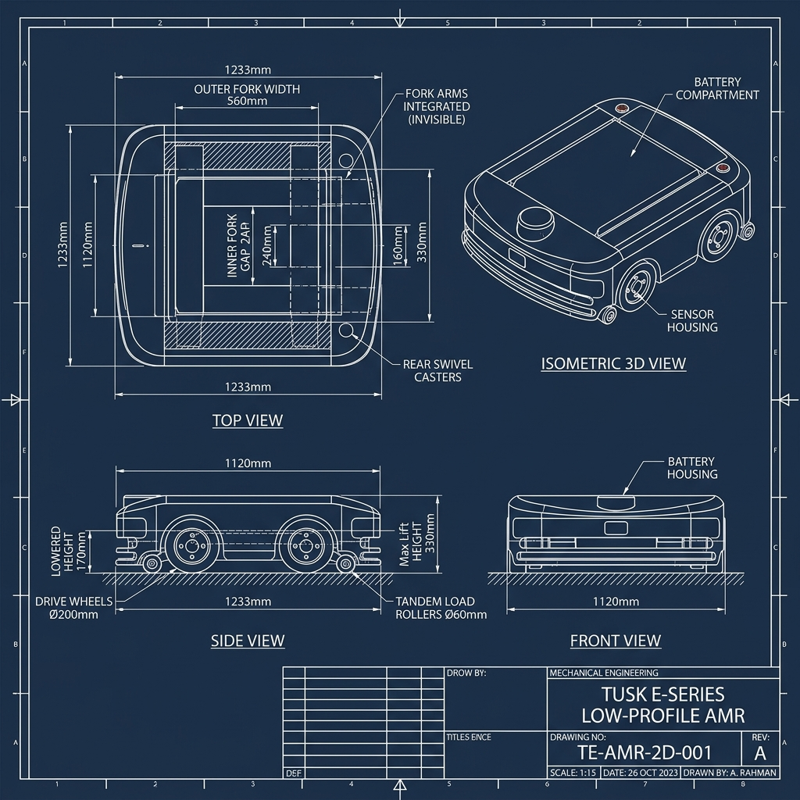

# Tusk Robots E-Series (Invisible Fork Arm) Pallet AMR - CAD Design & Dimensioning Guide

This document provides all verified dimensions, mechanical specifications, tolerances, and CAD blueprint sheets required to 3D model and manufacture the **Tusk Robots E-Series Low-Profile Pallet AMR** (E10 Standard & E10T Telescopic "Invisible Fork Arm" models).

---

## 1. Master CAD Dimensioning Summary

Below is the consolidated master dimensions table to be used directly in SolidWorks, Fusion 360, or Inventor for 3D modeling:

| Engineering Parameter | Dimension (mm) | Tolerance | Notes & CAD Reference |
| :--- | :--- | :--- | :--- |
| **Overall Robot Length** | **1233 mm** | $\pm 1.0\text{ mm}$ | Front bumper to rear caster housing |
| **Overall Robot Width** | **1120 mm** | $\pm 1.0\text{ mm}$ | Outer steel weldment frame envelope |
| **Chassis Lowered Height** | **170 mm** | $\pm 0.5\text{ mm}$ | Top of platform to floor (lowered) |
| **Max Lift Height (Top of Deck)** | **330 mm** | $\pm 1.0\text{ mm}$ | Total vertical lift travel: $160\text{ mm}$ |
| **Fork Assembly Outer Width** | **560 mm** | $\pm 0.5\text{ mm}$ | Fits standard EUR-2 / ISO pallets |
| **Fork Assembly Inner Gap** | **240 mm** | $\pm 0.5\text{ mm}$ | Space between left and right tynes |
| **Individual Tyne Width** | **160 mm** | $\pm 0.5\text{ mm}$ | $\frac{560 - 240}{2} = 160\text{ mm}$ tyne width |
| **Fork Nominal Length (E10)** | **1100 mm** | $\pm 1.0\text{ mm}$ | Standard fixed length fork tyne |
| **Fork Extension Reach (E10T)**| **1400 mm max** | $\pm 2.0\text{ mm}$ | Multi-stage telescopic reach |
| **Drive Wheel Diameter** | **$\varnothing 200\text{ mm}$** | $\pm 0.2\text{ mm}$ | Polyurethane tread, $65\text{ mm}$ width |
| **Tandem Load Roller Diameter** | **$\varnothing 60\text{ mm}$** | $\pm 0.2\text{ mm}$ | Polyurethane 95A, $180\text{ mm}$ length |
| **Roller Bogie Outer Length** | **198 mm** | $\pm 0.5\text{ mm}$ | Fits $180\text{ mm}$ roller + $2\times 8\text{ mm}$ plates |
| **Roller Shaft Specs** | **$\varnothing 20\text{ h6} \times 188\text{ mm}$** | $\pm 0.1\text{ mm}$ | EN8 Steel with circlip grooves |
| **Minimum Ground Clearance** | **25 mm** | $\pm 0.5\text{ mm}$ | Chassis base plate to floor clearance |

---

## 2. 2D Master CAD Dimensioned Blueprint Sheet

Use the engineering drawing sheet below for placing sketch origins, centerlines, and datum planes during 3D CAD modeling:

---

## 3. Product Family Real Models Showcase

### A. Tusk Model E10 (Standard Low-Profile Pallet AMR)
Integrated low-profile pallet AMR featuring fixed-length "invisible" fork tynes and passive mechanical pull-rod wheel deployment.
* **Payload Rating:** $1000\text{ kg}$
* **Real Product Photo:**

### B. Tusk Model E10T (Telescopic Extending Fork AMR)
Equipped with dual-stage telescoping tynes that extend up to $1400\text{ mm}$ out into pallet racks while the AMR remains stationary.
* **Payload Rating:** $1000\text{ kg}$
* **Extension Reach:** $1400\text{ mm}$
* **Real Product Photo:**

---

## 4. Detailed Component Bill of Materials (BOM) & Materials

When modeling individual parts and assemblies, use the following material assignments and component callouts:

| Item No. | Component Name | Material / Spec | Quantity | Critical Dimensions / Notes |
| :---: | :--- | :--- | :---: | :--- |
| **1** | **Base Frame Weldment** | Q235 Steel Tube ($80\times 60\times 4\text{ mm}$) | 1 Set | Inner frame cutout: $960\text{ mm} \times 713\text{ mm}$ |
| **2** | **Top Platform (Fork Deck)**| Q235 Steel Plate ($8\text{ mm}$) | 1 Pc | Overall: $1100\times 560\text{ mm}$; $8\times \varnothing 11\text{ mm}$ holes |
| **3** | **Scissor Arm (Part 1)** | Rectangular Tube ($60\times 40\times 6\text{ mm}$) | 2 Pcs | Total length: $760\text{ mm}$; Pivot C-to-C: $720\text{ mm}$ |
| **4** | **Scissor Arm (Part 2)** | Rectangular Tube ($60\times 40\times 6\text{ mm}$) | 2 Pcs | Mirrored cross arm with central $\varnothing 20\text{ H7}$ bore |
| **5** | **Cross Pin (Pivot)** | EN8 Steel ($\varnothing 20\text{ h6}$) | 4 Pcs | Body length: $120\text{ mm}$; Total length: $140\text{ mm}$ |
| **6** | **Pivot Bushing** | Bronze CuSn12 | 8 Pcs | Outer: $\varnothing 25\text{ h6}$, Inner: $\varnothing 20\text{ H7}$, Length: $25\text{ mm}$ |
| **7** | **Ball Screw Shaft** | SCM415 Hardened Steel | 1 Pc | Spec: SFU2505 (Dia $25\text{ mm}$, Lead $5\text{ mm}$), $600\text{ mm}$ L |
| **8** | **Ball Nut & Housing** | Cast Steel Block | 1 Pc | Nut body: $\varnothing 40\text{ mm}$, Flange: $55\text{ mm}$ sq, $4\times \varnothing 9$ holes |
| **9** | **BK15 Bearing Block** | Cast Iron Housing | 2 Pcs | Base: $89\times 34\text{ mm}$, Height: $39\text{ mm}$, Bore: $\varnothing 15\text{ mm}$ |
| **10** | **Drive Motor** | 750W 24V BLDC Motor | 2 Pcs | Rated speed: $3000\text{ RPM}$, Gearbox ratio: 1:20 |
| **11** | **Lift Motor** | 1000W 24V BLDC Motor | 1 Pc | Rated speed: $3000\text{ RPM}$, Gearbox ratio: 1:15 |
| **12** | **Roller Bogie Housing** | Q235 Steel Plate ($8\text{ mm}$) | 2 Sets | Outer length: $198\text{ mm}$, Height: $102\text{ mm}$, Width: $75\text{ mm}$ |
| **13** | **Polyurethane Roller** | Polyurethane 95A Shore | 4 Pcs | Outer dia: $\varnothing 60\text{ mm}$, Inner dia: $\varnothing 20\text{ mm}$, Length: $180\text{ mm}$ |

---

## 5. Subsystem Mechanical Schematics

### A. Vertical Lift Carriage Drive
The vertical carriage moves on twin HGR25 linear rails and is driven by the central SFU2505 ball screw:

### B. Folding Load Roller Kinematics
For standard E10 models, the front tandem load rollers retract inside the fork cavity when lowered, and deploy down to touch the floor when raised:

---

## 6. General CAD Modeling Guidelines & Tolerances

1. **Standard Machining Tolerances (ISO 2768-m):**
   * $0 - 6\text{ mm}$: $\pm 0.1\text{ mm}$
   * $6 - 30\text{ mm}$: $\pm 0.2\text{ mm}$
   * $30 - 120\text{ mm}$: $\pm 0.3\text{ mm}$
   * $120 - 400\text{ mm}$: $\pm 0.5\text{ mm}$
   * $400 - 1000\text{ mm}$: $\pm 0.8\text{ mm}$
   * $1000 - 2000\text{ mm}$: $\pm 1.0\text{ mm}$
2. **Weldment Notes:**
   * All structural tube joints require **$6\text{ mm}$ continuous fillet welds** (MIG process, ER70S-6 filler wire).
   * All sharp edges and corners must be deburred with $R1 - R2\text{ mm}$ radii.
3. **Surface Finish:**
   * Industrial powder coating (Orange RAL 2004 / Dark Grey RAL 7016), dry film thickness $80 - 100\,\mu\text{m}$.
